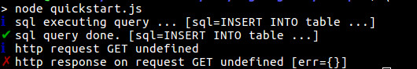
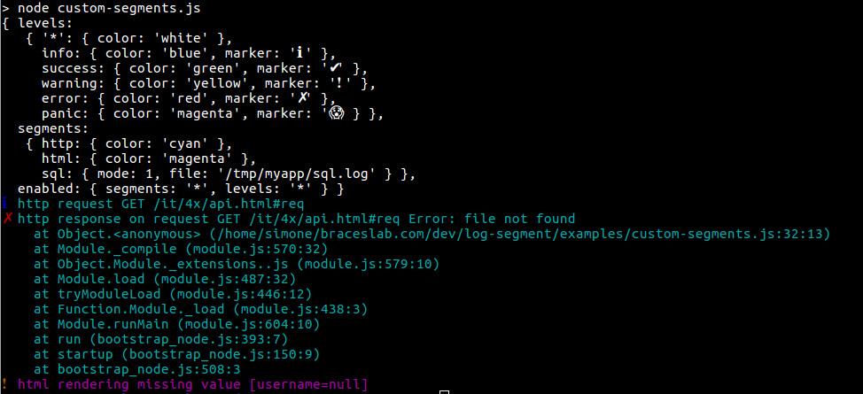
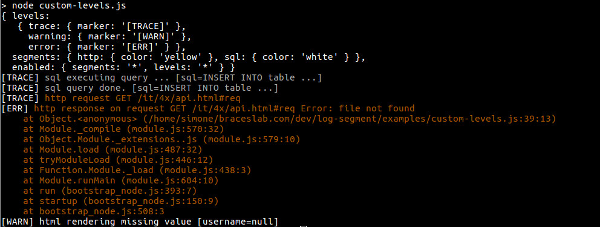

# log-segment

[](https://www.npmjs.org/package/log-segment)
[](https://www.npmjs.org/package/log-segment)

[](https://nodei.co/npm/log-segment/)

[](http://standardjs.com/)

Javascript logger with partition  

## Purpose

Why Another Log Module? Because not all logs are equal.  
I'd like to use a pliable tool to quickly manage logs by two factors: **level** and **segment**.  

## Installing

````bash
$ npm i -g log-segment
````

### Quick start

``log-segment`` is single-ton, so just require and use everywhere.

````js
const log = require('log-segment')

const sql = 'INSERT INTO table ...'
log.info('sql', 'executing query ...', log.value('sql', sql))
db.query(sql)
.then(() => {
  log.success('sql', 'query done.', log.value('sql', sql))
})
.catch((err) => {
  log.error('sql', 'query error', log.value('sql', sql))
})
````

````js
const log = require('log-segment')

require('express')().all('/*', (request, response) => {
  log.info('http', 'request', request.method, request.baseUrl)
  
  doSomething(request)
  .then((output) => {
    response.send(output)
    log.success('http', 'response on request', request.method, request.baseUrl)
  })
  .catch((err) => {
    response.sendStatus(500)
    log.error('http', 'response on request', request.method, request.baseUrl, log.value('err', err))
  })
})
````



#### Default settings

Default settings provide any levels and segments enabled to console output.  
Default levels are: *info, success, warning, error, panic*.  
There is no hierarchy by levels.

````js
{ 
  levels: {
     '*': { color: 'white' },
     info: { color: 'blue', marker: 'ℹ️' },
     success: { color: 'green', marker: '✔' },
     warning: { color: 'yellow', marker: '❗️️' },
     error: { color: 'red', marker: '✗️' },
     panic: { color: 'magenta', marker: '😱' }
  },
  segments: { '*': { color: 'white' } },
  template: '{marker} [{timestamp}] {message}',
  enabled: { segments: '*', levels: '*' } 
}
````

##### Custom segments

````js
const log = require('log-segment')

log.set({
  segments: {
    http: {
      color: 'cyan'
    },
    html: {
      color: 'magenta'
    },
    sql: {
      mode: log.mode.FILE,
      file: '/tmp/myapp/sql.log'
    }
  }
})

const sql = 'INSERT INTO table ...'

log.info('sql', 'executing query ...', log.value('sql', sql))
log.success('sql', 'query done.', log.value('sql', sql))

const request = {
  method: 'GET',
  baseUrl: '/it/4x/api.html#req'
}

const err = new Error('file not found')

log.info('http', 'request', request.method, request.baseUrl)
log.error('http', 'response on request', request.method, request.baseUrl, log.value('err', err))

let username = null
log.warning('html', 'rendering missing value', log.value('username', username))

````



#### Custom levels

````js
const log = require('log-segment')

log.set({
  segments: {
    http: {
      color: 'yellow'
    },
    sql: {
      color: 'white'
    }
  },
  levels: {
    trace: {
      marker: '[TRACE]'
    },
    warning: {
      marker: '[WARN]'
    },
    error: {
      marker: '[ERR]'
    }
  }
})

const sql = 'INSERT INTO table ...'

log.trace('sql', 'executing query ...', log.value('sql', sql))
log.trace('sql', 'query done.', log.value('sql', sql))

const request = {
  method: 'GET',
  baseUrl: '/it/4x/api.html#req'
}

const err = new Error('file not found')

log.trace('http', 'request', request.method, request.baseUrl)
log.error('http', 'response on request', request.method, request.baseUrl, log.value('err', err))

let username = null
log.warning('html', 'rendering missing value', log.value('username', username))
````



#### Custom format

Default format is ``'{marker} [{timestamp}] {message}'``.  
You can also add ``{trace}``  

````js
log.set({
  format: '{marker} [{timestamp}] {message} {trace}'
})
````

### Use Cases

````js
log.set({
  segments: {
    http: { color: 'cyan' },
    network: { color: 'blue' },
    db: { color: 'yellow' },
    sql: { }
  }
})
````

**Development**
Just enable everything on console

````js
log.set({ enabled: { segments: '*', levels: '*' } })
````

**Debug**
Enable only segments to focus on, at any levels, to find that bug

````js
log.set({ enabled: { segments: ['sql', 'network'] } })
````

**Production**

Different behaviour for each level:
  - disable not interesting parts: success level, template rendering
  - different file for each type: *info, warning, error*
    and remove marks
  - separate sql file
  - on panic send email

````js
log.set({
  enabled: {
    segments: ['sql'],
    levels: ['info', 'warning', 'error', 'panic']
  },
  segments: {
      sql: {
        mode: log.mode.FILE,
        file: '/var/log/myapp/sql'
      }
  },
  levels: {
    info: {
      marker: '[i]',
      mode: log.mode.FILE,
      file: '/var/log/myapp/info'
    },
    warning: {
      marker: '[warn]',
      mode: log.mode.FILE,
      file: '/var/log/myapp/warn'
    },
    error: {
      marker: '[err]',
      mode: log.mode.FILE,
      file: '/var/log/myapp/error'
    },
    panic: {
      mode: log.mode.MAIL,
        email: {
          transporter: {
            service: 'gmail',
            auth: {
              user: '***@gmail.com',
              pass: '***'
            }
          }
        }
        options: {
          from: '"log-segment" <log-segment@test.test>',
          to: 'sys-admin@gmail.com',
          subject: 'myapp PANIC'
        }
      }
    }
  }
})
````

## Documentation

See [documentation](./doc/README.md) for further informations.

## Changelog

v. 1.3.0

- Add customizable output format
- Add message info: trace, timestamp

v. 1.2.0

- Add .check(): check settings for 
  - console > color
  - files > write permission
  - emails > send settings

v. 1.1.0

- Add support for email mode

## TODO

- custom format for each level (ex. add trace only in panic)
- add chrono > ``log.chrono('tag')``
- browser support (mode: console - no colors, file - fs.html5)
- custom format in log.value
- custom mode: stream, (sms, telegram and whatever)
- multiple mode for each setting (example: on panic send email + log to file + send sms + call mom)
- customizable action (example: on error run function)
- (evaluate) support workers (as transport)
  - [pino](https://github.com/pinojs/pino)
  - [npmlog](https://github.com/npm/npmlog)
  - [winston](https://github.com/winstonjs/winston)
  - [log](https://github.com/tj/log.js)
  - [debug](https://github.com/visionmedia/debug)
  - [bunyan](https://github.com/trentm/node-bunyan)
  - others?

---

## License

The MIT License (MIT)

Copyright (c) 2017, [braces lab](https://braceslab.com)

Permission is hereby granted, free of charge, to any person obtaining a copy
of this software and associated documentation files (the "Software"), to deal
in the Software without restriction, including without limitation the rights
to use, copy, modify, merge, publish, distribute, sublicense, and/or sell
copies of the Software, and to permit persons to whom the Software is
furnished to do so, subject to the following conditions:

The above copyright notice and this permission notice shall be included in all
copies or substantial portions of the Software.

THE SOFTWARE IS PROVIDED "AS IS", WITHOUT WARRANTY OF ANY KIND, EXPRESS OR
IMPLIED, INCLUDING BUT NOT LIMITED TO THE WARRANTIES OF MERCHANTABILITY,
FITNESS FOR A PARTICULAR PURPOSE AND NONINFRINGEMENT. IN NO EVENT SHALL THE
AUTHORS OR COPYRIGHT HOLDERS BE LIABLE FOR ANY CLAIM, DAMAGES OR OTHER
LIABILITY, WHETHER IN AN ACTION OF CONTRACT, TORT OR OTHERWISE, ARISING FROM,
OUT OF OR IN CONNECTION WITH THE SOFTWARE OR THE USE OR OTHER DEALINGS IN THE
SOFTWARE.
