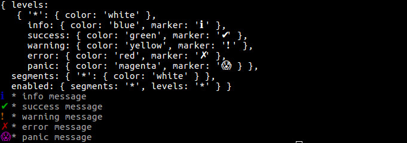

# log-segment

- [Installing](#installing)
- [Getting Started](#getting-started)
- [Settings](#settings)
- [API](#api)  
  - [.set](#.set)
  - [.get](#.get)
  - [.add](#.add)
  - [.value](#.value)
  - [.check](#.check)

---

# Installing

````bash
$ npm i log-segment
````

# Getting Started

````js
const log = require('log-segment')

const sql = 'INSERT INTO table ...'
log.info('sql', 'executing query ...', log.value('sql', sql))
db.query(sql)
.then(() => {
    log.success('sql', 'query done.', log.value('sql', sql))
})
.catch((err) => {
    log.error('sql', 'query error', log.value('sql', sql))
})

// ...
fn()
.then(resolve)
.catch((err) => {
    log.error('network', log.value('err', err))
    reject(err)
})
````

# Settings

## Segment

Segment define a logical partion of log.  
A segment is defined by:
- name: label
- output mode: output mode, default is console, see mode description

``*`` segment is a default settings for undefined segment

Example: 

````js

'*': {
  color: 'white'
}

http: {
  color: 'white'
}


template: {
  color: 'yellow'
  mode: log.mode.CONSOLE
}


http: {
  mode: log.mode.FILE,
  file: '/var/log/myapp/http.log'
}
````

## Level

Level define the log importance, actually define a function in log module.  
A level is defined by:
- name: label and function name
- output mode: output mode, default is console, see mode description
- marker: a string prependend to output

Example: 

````js

info: {
  color: 'white'
  marker: '[info]'
}

notice: {
  color: 'yellow'
  mode: log.mode.CONSOLE
  marker: 'notice:'
}

error: {
  mode: log.mode.FILE,
  marker: ''
  file: '/var/log/myapp/error.log'
}
````

## Mode

- **CONSOLE**

Default output, perform output to console.  
The format output is  
``[level-marker-colored] [segment-name-colored] [ouput-segment-colored]``

Available colors are on [chalk](https://www.npmjs.com/package/chalk).

- **FILE**

Append output to file. Do not perform anything else like rotation, just append a line. Color is ignored.

The format output is  
``[level-marker] [segment-name] [ouput]``

````js
error: {
  mode: log.mode.FILE,
  marker: ''
  file: '/var/log/myapp/error.log'
}
````

- **EMAIL**

Send an email, in text format. 
Use [nodemailer](https://www.npmjs.com/package/nodemailer), see the package for ``transporter`` and ``options`` settings.
Color is ignored.

The email body is  
``[level-marker] [segment-name] [ouput]``

````js
error: {
  mode: log.mode.EMAIL,
  email: {
    transporter: {
      service: 'gmail',
      auth: {
        user: '***@gmail.com',
        pass: '***'
      }
    },
    options: {
      from: '"log-segment" <log-segment@test.test>',
      to: 'sys-admin@gmail.com',
      subject: 'YOUR-APPLICATION: PANIC ERROR'
    }
  }
}
````

### Priority

If segment and level have different output mode, only one is performed.  

The priority sequence is:
- segment mode EMAIL -> send email segment settings
- level mode EMAIL -> send email level settings
- segment mode FILE -> write to file segment settings
- level mode FILE -> write to file level settings
- write to console

Example
````js
log.error('db', 'connection error')
````

If error level is EMAIL and db segment is FILE, will be send an email usign error level settings.

### Default settings

````js
const log = require('log-segment')

console.log(log.get())

log.info('*', 'info message')
log.success('*', 'success message')
log.warning('*', 'warning message')
log.error('*', 'error message')
log.panic('*', 'panic message')
````



# API

#### .set

````js
.set(settings)
````

Set levels and/or segments and/or enabled

````js
settings.levels = {
  level0,
  level1,
  level2,
  ...
}

settings.segments = {
  segment0,
  segment1,
  segment2,
  ...
}

settings.enabled = { levels: '*' }

settings.enabled = { levels: ['level-name', 'level-name'] }

settings.enabled = { levels: null or [] }
````

Example  
````js
log.set({
  segments: {
    http: {
      color: 'yellow'
    },
    sql: {
      color: 'white'
    }
  },
  levels: {
    trace: {
      marker: '[TRACE]'
    },
    warning: {
      marker: '[WARN]'
    },
    error: {
      mode: log.mode.EMAIL,
      email: {
        transporter: {
          service: 'gmail',
          auth: {
            user: '***@gmail.com',
            pass: '***'
          }
        },
        options: {
          from: '"log-segment" <log-segment@test.test>',
          to: 'sys-admin@gmail.com',
          subject: 'YOUR-APPLICATION: PANIC ERROR'
        }
      }
    }
  }
})
````

#### .get

````js
.get()
````

Return Object with current settings

#### .add

````js
.add(settings)
````

Add settings; same as ``.set``, but add settings instead of replace. If segment or level aready exists, override.

````js
settings.levels = {
  level0,
  level1,
  level2,
  ...
}

settings.segments = {
  segment0,
  segment1,
  segment2,
  ...
}

````

#### .value

````js
.value(label, value)
````

aliases: ``.val``, ``.v``

.value is used to encapsulate ``value`` and defer the moment to convert to string to the actual print.  
It's useful for:
- prevent heavy operation like ``JSON.strigify`` only if needed (output can be suppressed by settings)
- don't worry about formatting Object, Date, Error etc
- easily collect variables in same format

Actually return a function.

The ouput is ``[label=value]``

#### .test

````js
.check()
````

Check output settings:
  - check valid colors
  - check emails settings sending sample emails
  - check files settings write sample logs
  
return ``Promise(resolve(), reject(err))``
